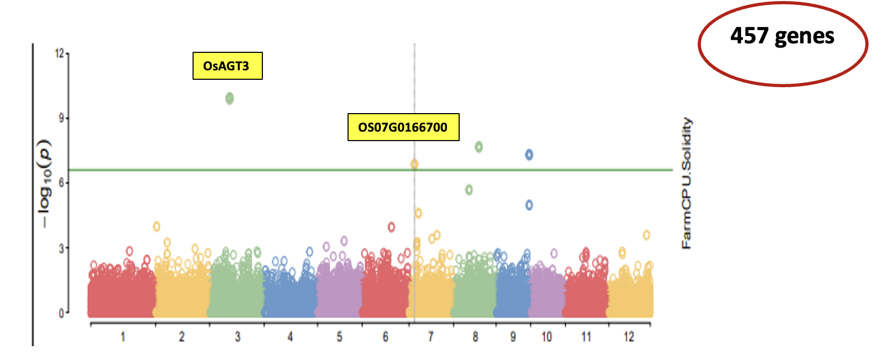
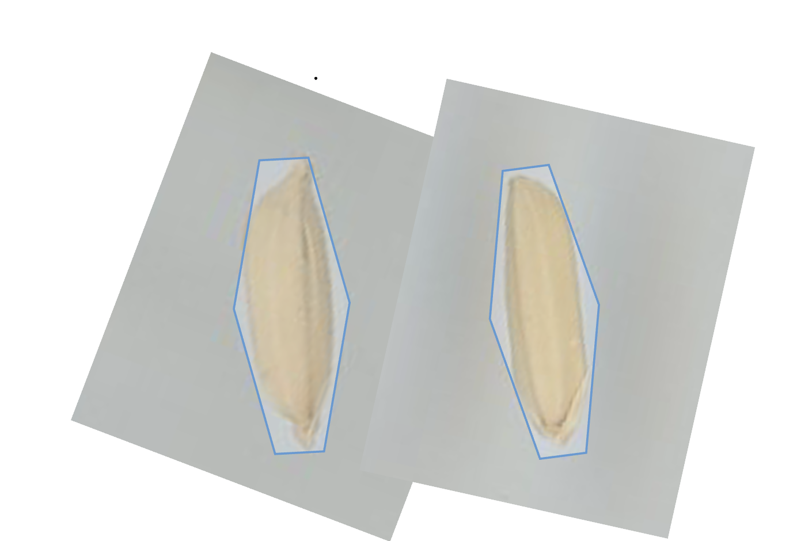
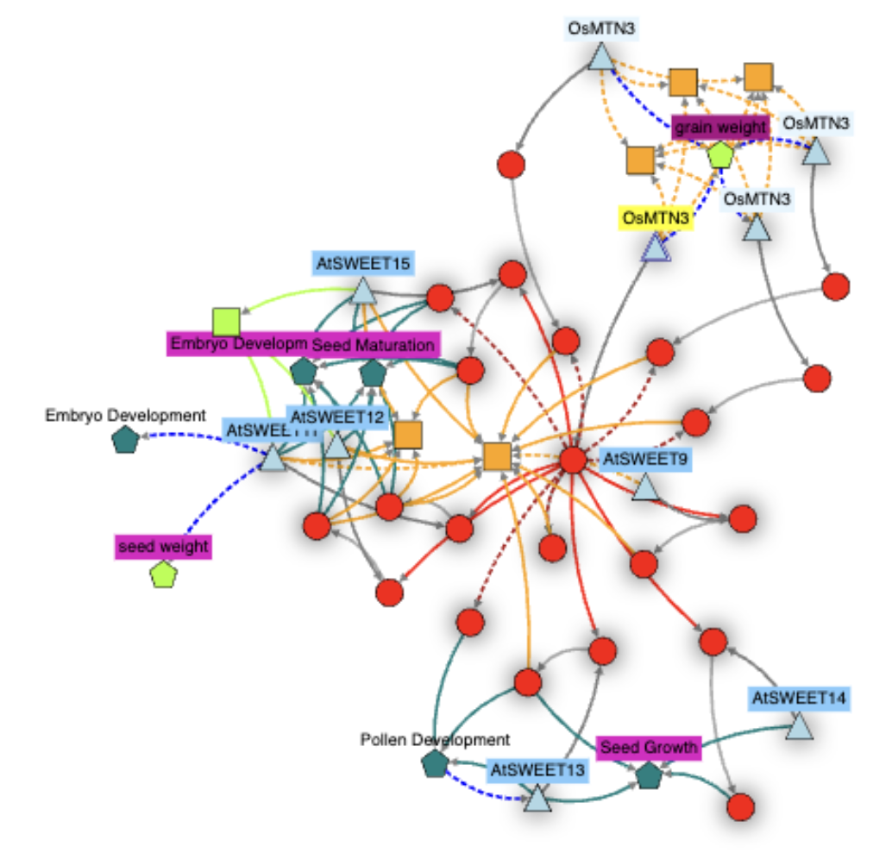
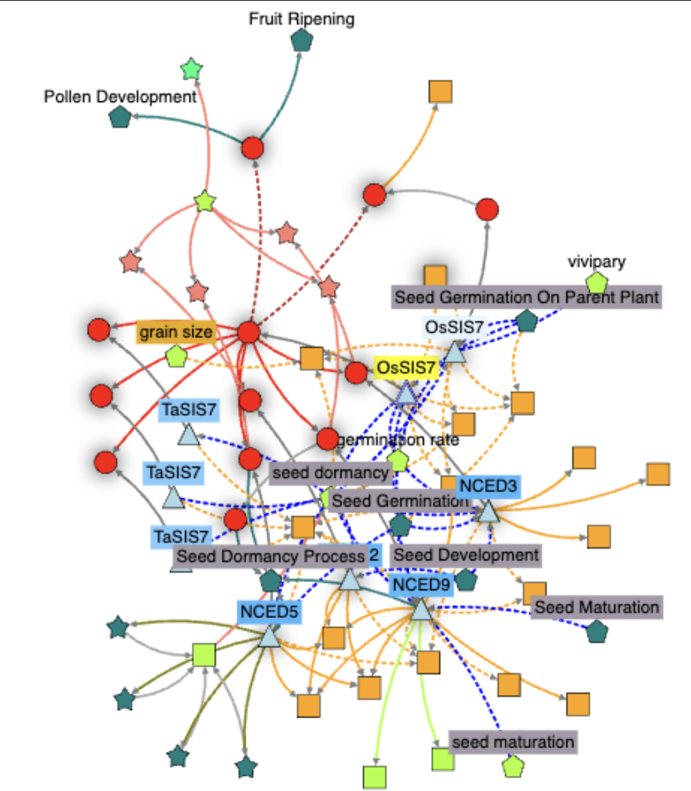
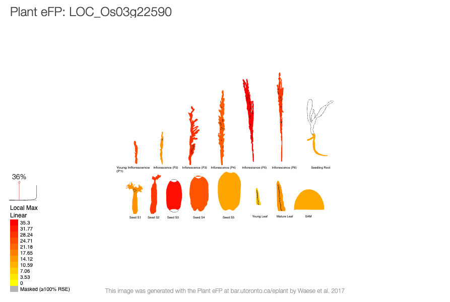
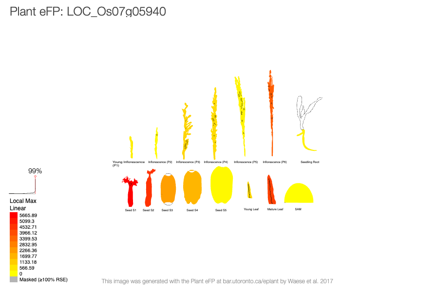
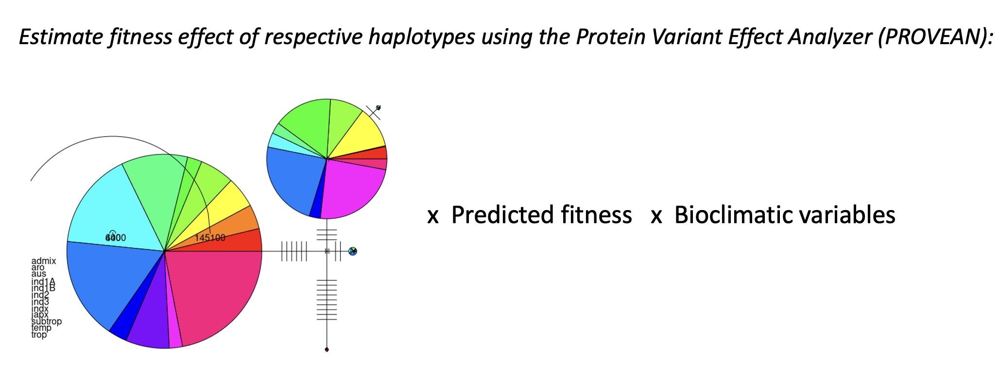
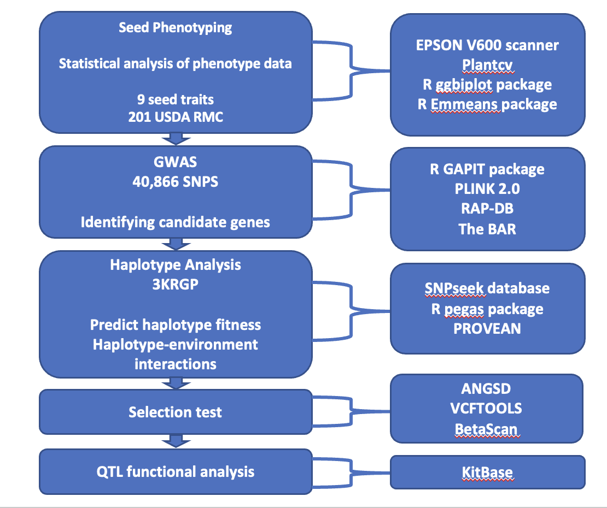

<h1>Genetic Basis of Rice Seed Traits for Adaptation</h1>

Germplasm collections hold diverse alleles shaped by environmental conditions at centers of origin. In <i>Oryza sativa</i>, seed traits impact productivity, consumer preferences, and ecological adaptation, yet their genetic basis—especially in relation to environmental variation—remains unclear. This study seeks to answer the following key questions:

<ul>
    <li><strong>Are there novel differences between seed trait phenotypes among <i>O. sativa</i> subpopulations?</strong></li>
    <li><strong>Which genomic regions are associated with these phenotypes?</strong></li>
    <li><strong>Are these genomic regions functionally and adaptively relevant?</strong></li>
</ul>

Traditional seed phenotyping is labor-intensive and limited, making high-throughput alternatives essential. This study leverages PlantCV, a computer vision tool, for automated and detailed seed trait analysis, integrating it with GWAS and haplotype-environment association analysis—a largely unexplored combination. This approach enhances trait resolution, uncovering novel genetic candidates missed by conventional methods. By linking genetic variants, seed morphology, and environmental adaptation, this study aims to advance climate-smart breeding, optimizing rice varieties for resilience, productivity, and market preferences.

    

<strong>Fig 1.</strong> <i>Oryza spp.</i> Diversity

---------------------------------------------------------------------

<h3>Results</h3>

---------------------------------------------------------------------

<h4>Question 1: Are there novel differences between seed trait phenotypes among <i>O. sativa</i> subpopulations?</h4>

We generated twelve seed phenotypes with our phenotyping setup, including length, width, and area (Table 1). However, we classified differences observed between subpopulations for the following seed traits as novel differences:

<ul>
    <li>Convex hull vertices</li>
    <li>Convex hull area</li>
    <li>Solidity</li>
    <li>Longest path</li>
    <li>Eccentricity</li>
</ul>

PC1 explained a larger proportion of the variance (51.7%), revealing an inverse relationship between Solidity, Seed Weight, and other traits. PC2 accounted for 27.26% of the variation (Fig 2). Significant subpopulation differences were observed for the Solidity and Minor Axis seed phenotypes (Fig. 3). Specifically, we found a significant difference between the Aus and Indica subpopulations for Solidity, and between the Aus and Aro subpopulations for the Minor Axis.

    

<strong>Fig 2.</strong> Principal Component Analysis of Seed Trait Variation

  
  

  <strong>Fig 3</strong>: Seed Trait ANOVA: 
  <strong>A</strong>. ANOVA for Minor Axis Variation Across Rice Subpopulations. 
  <strong>B</strong>: ANOVA for Solidity Variation Across Rice Subpopulations.

---------------------------------------------------------------------

<h4>Question 2: Which genomic regions are associated with these seed traits?</h4>

Our GWAS analysis revealed significant SNPs on chromosomes 3, 7, 8, and 9. For downstream gene candidate identification, we focused on the LD regions on chromosomes 3 and 7. Chromosome 3 exhibited the most significant association (p-value = 7 × 10⁻⁷), while the association on chromosome 7 was identified by multiple GWAS methods. We identified 457 genes within the 1MB LD region on chromosomes 3 and 7, specifically for the Solidity seed trait (Fig. 4). From this set, we selected 100 genes within the LD of significant SNPs on these chromosomes and computed knetscores using [knetminer](https://knetminer.com/) (Fig. 5). Knetscores rank nodes in a biological network based on their relevance to a specific context.

  
  

  <strong>Fig 4</strong>: GWAS for Solidity Seed Trait: 
  <strong>A</strong>. Manhattan plot showing significant associations on chromosomes 3, 7, 8, and 9. 
  <strong>B</strong>: Solidity phenotype (Solidity = Seed Area/Convex Hull Area; Ratios = 1 (Rounder seeds) and Ratios < 1 (More slender seeds)).

---------------------------------------------------------------------

<h4>Question 3: Are these genomic regions likely of any functional and adaptive relevance?</h4>

    On chromosome 3, OsMTN3, also known as SWEET12, had the highest knetscore of 53.6. OsMTN3 plays a crucial role in sucrose transport during early grain filling, and its disruption leads to defective grain filling and reduced seed size 
    [Ma *et al.*, 2017](https://pubmed.ncbi.nlm.nih.gov/28371825/).

    On chromosome 7, OsSIS7 had the highest knetscore of 98.9 (Fig. 5). OsSIS7 has been implicated in the regulation of seed and grain size in rice. Studies have shown that mutations in OsSIS7 can lead to alterations in seed size, which is a critical trait for yield improvement. The gene's role in seed development is linked to its influence on cell division and expansion processes, which are crucial for determining final seed size 
    [Zhang *et al.*, 2013](https://pubmed.ncbi.nlm.nih.gov/23911125/).

  
  

  <strong>Fig 5:</strong> Network map of OsMTN3 and OsSIS7 genes: Both genes were biologically relevant in molecular pathways involved in regulating seed and reproductive development, including size, weight, and pollen development. 
  <strong>A.</strong> OsMTN3. 
  <strong>B.</strong> OsSIS7.

  
  

  <strong>Fig 6:</strong> Spatiotemporal expression of OsMTN3 and OsSIS7 genes. 
  <strong>A.</strong> OsMTN3 is highly expressed in young seeds (S2 and S3 stage). 
  <strong>B.</strong> OsSIS7 is highly expressed in young seeds (S1 and S2 stage)

We are currently exploring the relationship between the haplotype fitness these identified genes and bioclimatic factors using multivariate analysis (Fig. 7). This will help infer how genotype-by-environment (GxE) interactions drive seed trait variation in *O. sativa*. Climate data for rice-growing regions will be retrieved from the BIOCLIM dataset, and we are using the [3K rice genome dataset](https://iric.irri.org/projects/3000-rice-genomes-project) for our haplotype analysis.

    

<strong>Fig 6.</strong> Methodology for Gene Haplotype x Environmental Interaction

--------------------------------------------------------------------------

<h3>Conclusion</h3>

--------------------------------------------------------------------------

Solidity reflects both seed-specific traits and broader aspects of plant reproduction and development. This study highlights the potential of computer vision as a powerful tool for identifying pleiotropic genes and unraveling complex genetic interactions.

--------------------------------------------------------------------------

<h3>Methods</h3>

--------------------------------------------------------------------------

<h4>Plant Material</h4>

We used the USDA Mini-Core (MC) collection, comprising 217 <i>Oryza spp.</i> accessions from five major subpopulations. These were selected from 1794 accessions across 114 countries and deposited in the Genetic Stock <i>Oryza</i> collection (GSOR) in 2007 (<a href="https://www.ars-grin.gov/">USDA ARS, 2023</a>).

<h4>Seed Phenotyping</h4>

We scanned 201 <i>O. sativa</i> seed samples using an Epson V600 scanner with a standardized setup, including a black tray, ruler, and color standards. Each scan contained ~50 well-spaced seeds to minimize measurement errors. Images were named systematically for compatibility with PlantCV. Image processing was performed on a personal computer (Intel® Core™ i5-1035G1, 7.6 GB RAM), using a modified PlantCV Python pipeline to standardize RGB images, segment seeds, and measure 12 traits per seed. Processed data and scripts are available on <a href="https://github.com/Uzezi93/Genetic-Basis-of-Seed-Trait-Variation-Rice">GitHub</a>.

  <strong>Table 1</strong>. Summary of 12 traits analyzed (Gehan <i>et al</i>., 2017; Marrano & Moyers, 2022).

<table style="width: 100%; border-collapse: collapse; margin-top: 20px;">
    <thead style="background-color: #f2f2f2;">
        <tr>
            <th style="padding: 12px; text-align: left; border: 1px solid #ddd; font-weight: bold;">Trait</th>
            <th style="padding: 12px; text-align: left; border: 1px solid #ddd; font-weight: bold;">Scale/Description</th>
            <th style="padding: 12px; text-align: left; border: 1px solid #ddd; font-weight: bold;">Interpretation</th>
        </tr>
    </thead>
    <tbody>
        <tr style="background-color: #f9f9f9;">
            <td style="padding: 10px; border: 1px solid #ddd;"><strong>Area</strong></td>
            <td style="padding: 10px; border: 1px solid #ddd;">Pixels – Total number of pixels in a seed image</td>
            <td style="padding: 10px; border: 1px solid #ddd;">Seed size; seed area</td>
        </tr>
        <tr>
            <td style="padding: 10px; border: 1px solid #ddd;"><strong>Convex hull area</strong></td>
            <td style="padding: 10px; border: 1px solid #ddd;">Pixels – Total number of pixels in a seed convex hull</td>
            <td style="padding: 10px; border: 1px solid #ddd;">Seed shape and size; size of seed containing convex boundary (bigger seeds will require bigger convex hull)</td>
        </tr>
        <tr style="background-color: #f9f9f9;">
            <td style="padding: 10px; border: 1px solid #ddd;"><strong>Convex hull vertices</strong></td>
            <td style="padding: 10px; border: 1px solid #ddd;">Integer – Number of convex hull vertices</td>
            <td style="padding: 10px; border: 1px solid #ddd;">Seed shape: A convex hull with more vertices indicates seeds with unusual shapes.</td>
        </tr>
        <tr>
            <td style="padding: 10px; border: 1px solid #ddd;"><strong>Solidity</strong></td>
            <td style="padding: 10px; border: 1px solid #ddd;">Ratio – Seed area/Convex hull area</td>
            <td style="padding: 10px; border: 1px solid #ddd;">Seed shape; ratio of the grain area to the convex hull drawn around it. Values below 1 indicate bigger convex hull areas and possibly more slender seeds.</td>
        </tr>
        <tr style="background-color: #f9f9f9;">
            <td style="padding: 10px; border: 1px solid #ddd;"><strong>Perimeter</strong></td>
            <td style="padding: 10px; border: 1px solid #ddd;">Pixels – Total length of pixels around the seed image</td>
            <td style="padding: 10px; border: 1px solid #ddd;">Seed size and shape; seed outline</td>
        </tr>
        <tr>
            <td style="padding: 10px; border: 1px solid #ddd;"><strong>Width</strong></td>
            <td style="padding: 10px; border: 1px solid #ddd;">Pixels – Total span of seed pixels along the x-axis</td>
            <td style="padding: 10px; border: 1px solid #ddd;">Seed size: the width of the scanned seed measured on the x-axis of the seed image.</td>
        </tr>
        <tr style="background-color: #f9f9f9;">
            <td style="padding: 10px; border: 1px solid #ddd;"><strong>Length</strong></td>
            <td style="padding: 10px; border: 1px solid #ddd;">Pixels – Total span of seed pixels along the y-axis</td>
            <td style="padding: 10px; border: 1px solid #ddd;">Seed size: the length of the scanned seed measured on the y-axis of the seed image.</td>
        </tr>
        <tr>
            <td style="padding: 10px; border: 1px solid #ddd;"><strong>Longest path</strong></td>
            <td style="padding: 10px; border: 1px solid #ddd;">Pixels - Total pixels along the longest path between convex hull vertices through the center of mass</td>
            <td style="padding: 10px; border: 1px solid #ddd;">Seed size and shape; measurement outlier values can indicate seeds with unusual shape.</td>
        </tr>
        <tr style="background-color: #f9f9f9;">
            <td style="padding: 10px; border: 1px solid #ddd;"><strong>Ellipse major axis</strong></td>
            <td style="padding: 10px; border: 1px solid #ddd;">Pixels – Total pixel length along the major axis of the ellipse</td>
            <td style="padding: 10px; border: 1px solid #ddd;">Seed size: this is a proxy for seed length.</td>
        </tr>
        <tr>
            <td style="padding: 10px; border: 1px solid #ddd;"><strong>Ellipse minor axis</strong></td>
            <td style="padding: 10px; border: 1px solid #ddd;">Pixels – Total pixel length along the minor axis of the ellipse</td>
            <td style="padding: 10px; border: 1px solid #ddd;">Seed size: this is a proxy for seed width.</td>
        </tr>
        <tr style="background-color: #f9f9f9;">
            <td style="padding: 10px; border: 1px solid #ddd;"><strong>Ellipse angle</strong></td>
            <td style="padding: 10px; border: 1px solid #ddd;">Degrees – Angle of rotation of the ellipse major axis</td>
            <td style="padding: 10px; border: 1px solid #ddd;">This is the orientation of seeds on the scanner.</td>
        </tr>
        <tr>
            <td style="padding: 10px; border: 1px solid #ddd;"><strong>Ellipse eccentricity</strong></td>
            <td style="padding: 10px; border: 1px solid #ddd;">0-1 scale – Eccentricity of the bounding ellipse</td>
            <td style="padding: 10px; border: 1px solid #ddd;">Seed shape: this is an estimate of the degree of roundness of the seed objects. Values range from 0 (rounder seeds) to 1 (perfect ellipse or more slender seeds).</td>
        </tr>
    </tbody>
</table>

--------------------------------------------------------------------------

<h4>Data Analysis</h4>

<h4>Question 1: Novel Differences in Seed Traits Among *O. sativa* Subpopulations</h4>

We identified novel differences in seed traits among O. sativa subpopulations, focusing on convex hull vertices, convex hull area, solidity, longest path, and eccentricity. Traits like perimeter, area, length, and width were excluded as they have been extensively studied.

<h5>Statistical Analysis</h5>

- All analyses were conducted in R v4.2.3.
- Seed images were converted from pixels to millimeters for comparability.
- Outlier filtering was applied to remove extreme values due to scanning errors.
- Principal Component Analysis (PCA) was performed to understand trait variation.
- Pairwise comparisons of traits among subpopulations were conducted using the Emmeans package.
- Correlation analysis was used to explore relationships between traits.

<h4>Question 2: Genomic Regions Associated with Seed Traits
Genome-Wide Association Study (GWAS)</h4>

- Conducted GWAS using 40,866 high-density SNP markers.
- Used MLM, MLMM, and FarmCPU models in R GAPIT to identify significant SNPs (FDR ≤ 0.05).
- Chromosomes 3, 7, 8, and 9 were associated with seed traits.
- Linkage Disequilibrium (LD) decay analysis was performed using PLINK 2.0 to determine mapping resolution.

<h4>Question 3: Functional and Adaptive Relevance of Genomic Regions
Candidate Gene Identification</h4>

- Genes within a 1 MB LD window surrounding significant SNPs were identified using the MSUv7 Nipponbare genome.
- Spatiotemporal expression data from the Rice ePlant database was used to infer functional relevance.

<h5>Haplotype Analysis</h5>

- Conducted haplotype analysis on seed trait genes using the 3K Rice Genome dataset.
- SNP data was retrieved from SNPseek, with haplotypes.
- R pegas package was used to construct haplotype networks.

    

<h5>Follow-Up Analysis</h5>

- Investigate how haplotypes interact with climatic and agroecological variables to shape seed traits.
- Climate data will be retrieved from BIOCLIM, using landrace locations from the Genesys database.
- Multivariate analysis will explore genotype-by-environment (GxE) interactions driving seed trait variation in *O. sativa*.
