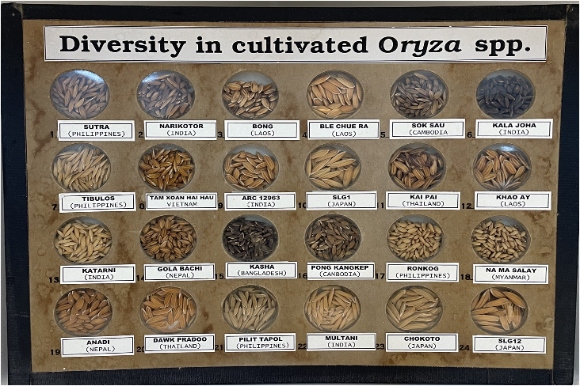

# Genetic Basis of Rice Seed Traits for Adaptation

Germplasm collections hold diverse alleles shaped by environmental conditions at centers of origin. In *Oryza sativa*, seed traits impact productivity, consumer preferences, and ecological adaptation, yet their genetic basis—especially in relation to environmental variation—remains unclear.This study seeks to answer the following key questions:

- **Are there novel differences between seed trait phenotypes among *O. sativa* subpopulations?**
- **Which genomic regions are associated with these phenotypes?**
- **Are these genomic regions functionally and adaptively relevant?**

Traditional seed phenotyping is labor-intensive and limited, making high-throughput alternatives essential. This study leverages PlantCV, a computer vision tool, for automated and detailed seed trait analysis, integrating it with GWAS and haplotype-environment association analysis—a largely unexplored combination. This approach enhances trait resolution, uncovering novel genetic candidates missed by conventional methods. By linking genetic variants, seed morphology, and environmental adaptation, this study aims to advance climate-smart breeding, optimizing rice varieties for resilience, productivity, and market preferences.

    

<strong>Fig 1.</strong> <i>Oryza spp.</i> Diversity

---
### Results

- #### Question 1: Are there novel differences between seed trait phenotypes among O. sativa subpopulations?

We generated twelve seed phenotypes with our phenotyping setup, including length, width, and area. However, we classified differences observed between subpopulations for the following seed traits as novel differences:

  -Convex hull vertices 
  -Convex hull area
  -Solidity
  -Longest path
  -Eccentricity

We observed subpopulation differences for the Solidity seed phenotype with a significant difference between the Aus and Indica subgroups. 

---
### Methods

- #### Plant Material  
We used the USDA Mini-Core (MC) collection, comprising 217 *Oryza spp.* accessions from five major subpopulations. These were selected from 1794 accessions across 114 countries and deposited in the Genetic Stock *Oryza* collection (GSOR) in 2007 ([USDA ARS, 2023](https://www.ars-grin.gov/)).

- #### Seed Phenotyping  
We scanned 201 *O. sativa* seed samples using an Epson V600 scanner with a standardized setup, including a black tray, ruler, and color standards. Each scan contained ~50 well-spaced seeds to minimize measurement errors. Images were named systematically for compatibility with PlantCV. Image processing was performed on a personal computer (Intel® Core™ i5-1035G1, 7.6 GB RAM), using a modified PlantCV Python pipeline to standardize RGB images, segment seeds, and measure 12 traits per seed. Processed data and scripts are available on [GitHub](https://github.com/Uzezi93/Genetic-Basis-of-Seed-Trait-Variation-Rice).

  <strong>Table 1</strong>. Summary of 12 traits analyzed (Gehan *et al*., 2017; Marrano & Moyers, 2022). 

 

| Trait                  | Scale/Description                                               | Interpretation |
|------------------------|----------------------------------------------------------------|----------------|
| **Area**              | Pixels – Total number of pixels in a seed image                | Seed size; seed area |
| **Convex hull area**  | Pixels – Total number of pixels in a seed convex hull          | Seed shape and size; size of seed containing convex boundary (bigger seeds will require bigger convex hull) |
| **Convex hull vertices** | Integer – Number of convex hull vertices                     | Seed shape: A convex hull with more vertices indicates seeds with unusual shapes. |
| **Solidity**          | Ratio – Seed area/Convex hull area                             | Seed shape; ratio of the grain area to the convex hull drawn around it. Values below 1 indicate bigger convex hull areas and possibly more slender seeds. |
| **Perimeter**        | Pixels – Total length of pixels around the seed image          | Seed size and shape; seed outline |
| **Width**           | Pixels – Total span of seed pixels along the x-axis             | Seed size: the width of the scanned seed measured on the x-axis of the seed image. |
| **Length**          | Pixels – Total span of seed pixels along the y-axis             | Seed size: the length of the scanned seed measured on the y-axis of the seed image. |
| **Longest path**     | Pixels - Total pixels along the longest path between convex hull vertices through the center of mass | Seed size and shape; measurement outlier values can indicate seeds with unusual shape. |
| **Ellipse major axis** | Pixels – Total pixel length along the major axis of the ellipse | Seed size: this is a proxy for seed length. |
| **Ellipse minor axis** | Pixels – Total pixel length along the minor axis of the ellipse | Seed size: this is a proxy for seed width. |
| **Ellipse angle**    | Degrees – Angle of rotation of the ellipse major axis          | This is the orientation of seeds on the scanner. |
| **Ellipse eccentricity** | 0-1 scale – Eccentricity of the bounding ellipse              | Seed shape: this is an estimate of the degree of roundness of the seed objects. Values range from 0 (rounder seeds) to 1 (perfect ellipse or more slender seeds). |

